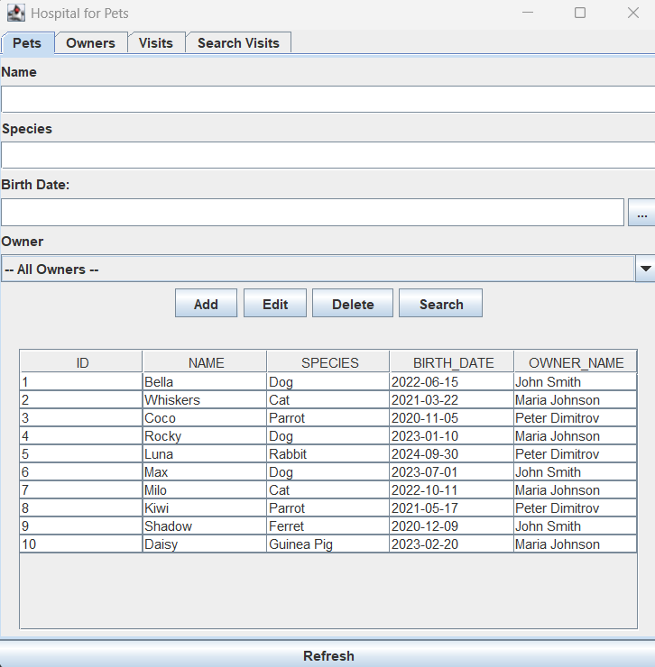
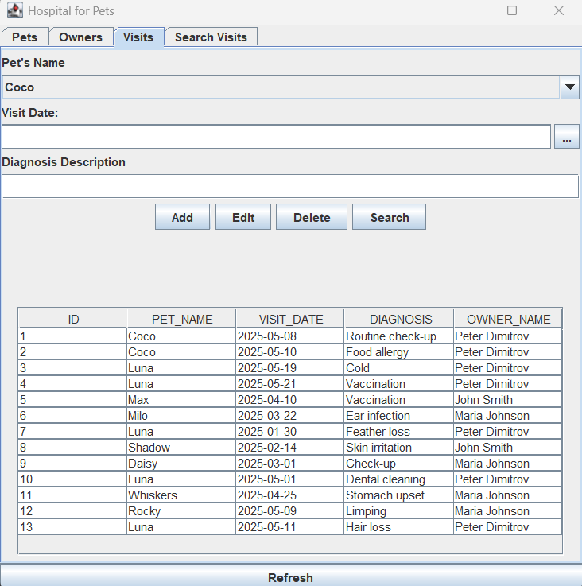
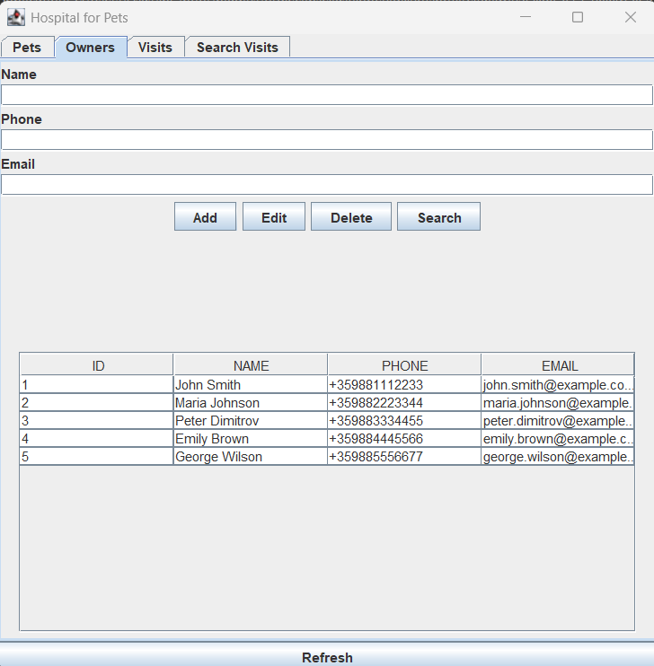

# 🐾 Hospital for Pets

**Hospital for Pets** is a desktop application built with **Java Swing**, designed to manage a veterinary clinic.  
It allows full CRUD operations for **owners**, **pets**, and **visits**, using a connected **relational database** built according to **Third Normal Form (3NF)**.  
The interface is clean, tab-based, and dynamically updates with user actions.

---

## 🖼️ Screenshots

Interface preview:

---

## 💡 Features

### 👥 Owners
- Add, edit, delete owners
- Search owners
- View a table of owners (name, phone, email)

### 🐶 Pets
- Manage pet data:
  - Name
  - Species
  - Birth date
  - Owner (linked by foreign key)
- Search pets

### 📅 Visits
- Add, edit, delete, and view visits
- Each visit is linked to a pet (and indirectly to its owner)
- Search visits

### 🔍 Visit Search
- Filter visits by:
  - Pet species
  - Visit date
- Results shown in a responsive table

### 🔄 Reset / Refresh
- Reset search filters
- Refresh data from the database

---

## 🧱 Technologies Used

- Java (Swing GUI)
- **H2 Database** (embedded SQL database)
- JDBC (Java Database Connectivity)
- SQL queries
- Object-Oriented Programming (OOP)

---

## 🗃️ Project Structure

- `Main.java` – entry point of the application
- `MyPanel.java` – GUI tabs
- `DatabaseManager.java` – database connection and queries
- `models/` – data models (Owner, Pet, Visit)
- `resources/` – icons, images, SQL scripts

---

## 🗄️ Database Schema

- `Owners` (Owner details)
- `Pets` (linked to `Owners` via foreign key)
- `Visits` (linked to `Pets` via foreign key)

All tables are properly normalized with no duplicate data or unnecessary IDs. The schema respects 3NF principles.

---

## 🚀 How to Run

1. Open the project in your IDE (IntelliJ, Eclipse, etc.)
2. Make sure the **H2 JDBC driver** is included in the project
3. Run `Main.java`
4. Use the tab-based interface to navigate through the system

---

## 👩‍💻 About the Project

This project was created as part of a university course.  
It demonstrates skills in **Java**, **database design (3NF)**, **JDBC**, and creating a user-friendly **desktop GUI** for CRUD operations.

Feel free to fork, contribute, or provide suggestions!

---

**Made with ❤️ for pets**
